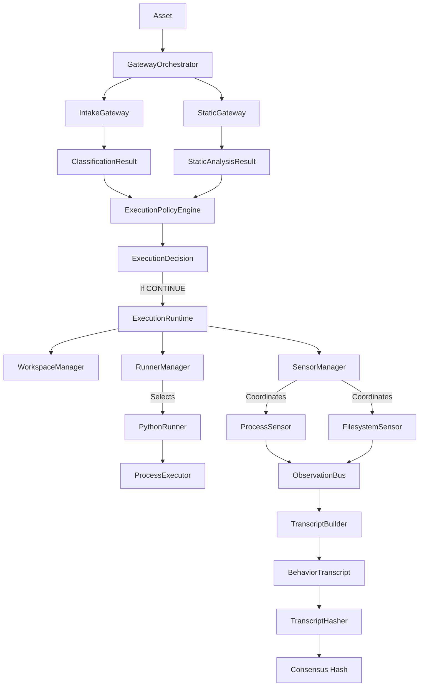

# Nebula

Nebula is a pluggable, deterministic malware analysis sandbox and verification engine that generates reproducible, implementation-independent behavior transcripts to enable consensus-based network validation.

## Architecture



## Current Capabilities (v0.3.x)

- **Verification Gateway Pipeline**: Multi-stage pipeline running intake analysis, static analysis, policy evaluation, and dynamic sandboxing.
- **Execution Policy Engine**: Evaluates asset category rules (archives, executables, scripts, images) and determines if dynamic analysis is needed.
- **pluggable Runtimes (Runner Manager)**: Runner abstraction enabling clean separation of executable script execution. Currently implements a concrete `PythonRunner`.
- **Stateless Lifecycle Sensors (Sensor Manager)**: Coordinates `ProcessSensor` and `FilesystemSensor` deterministically using priority ordering.
- **Clean Execution Isolation**: Restricts file modifications within a temporary `WorkspaceManager` and runs Python executions under a sanitized environment mapping.
- **Execution Timeout Enforcement**: Terminates infinite loops or hung processes after a configured timeout.
- **Canonical Transcripts & Deterministic Hashing**: Formulates clean behavioral evidence packages that exclude non-deterministic wall-clock/runtime metadata during hash calculations to ensure consensus reliability.

## Current Limitations

- **Scope**: Designed specifically for Python scripts (.py files) only.
- **Out of Scope**: PE/ELF executable binary sandboxing, APK analysis, kernel-level drivers, virtualization/sandbox evasion protection, and nested container analysis are deferred to future phases (v0.4.x+).

## How to Run

Tests can be executed in your local environment via the test suite runner:

```bash
python -m unittest discover -s tests
```

To run individual execution checks (e.g. the regression smoke test):

```bash
python tests/test_regression_suite.py
```

## How to Extend

### 1. Adding a New Sensor
Create a subclass of `Sensor` in `sandbox/sensors/` implementing the lifecycle methods:

```python
from sandbox.sensors import Sensor
from sandbox.observation.observation_bus import ObservationBus

class NetworkSensor(Sensor):
    def __init__(self, bus: ObservationBus):
        self._bus = bus
        self._connections = []

    @property
    def name(self) -> str:
        return "network"

    @property
    def priority(self) -> int:
        return 50  # Sensor execution order priority

    def before_execution(self) -> None:
        self._connections.clear()

    def observe(self, connection) -> None:
        self._connections.append(connection)

    def after_execution(self) -> None:
        for conn in self._connections:
            self._bus.publish(
                sensor=self.name,
                event_type="NETWORK_CONN",
                payload={"ip": conn.ip}
            )
        self._connections.clear()
```

### 2. Adding a New Runner
Create a subclass of `Runner` in `sandbox/runtime/` defining compatibility and run logic:

```python
from pathlib import Path
from sandbox.runtime import Runner, ExecutionResult
from sandbox.runtime.workspace import WorkspaceManager

class ShellRunner(Runner):
    @property
    def name(self) -> str:
        return "shell"

    def supports(self, asset: Path) -> bool:
        return asset.suffix == ".sh"

    def execute(self, asset: Path, workspace: WorkspaceManager) -> ExecutionResult:
        # Implementation to execute shell scripts and return ExecutionResult...
        return ExecutionResult(exit_code=0, timed_out=False, duration_ms=15)
```
