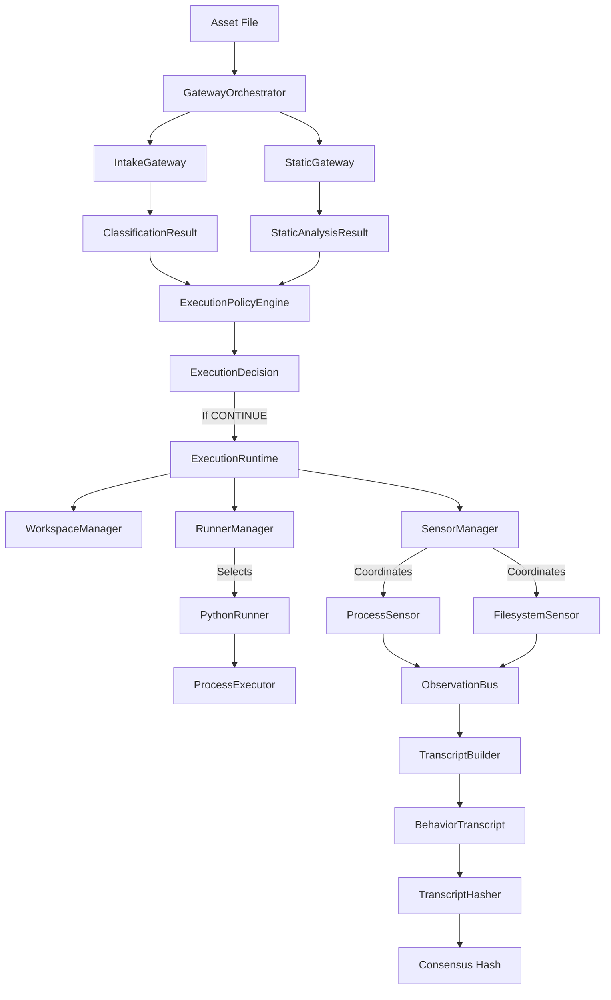

# Nebula Architecture Summary (v1.0.0)

## Subsystem Diagram

## Subsystem Highlights

### 1. Verification Pipeline (Orchestration)
Coordinates intake classification, static analysis, execution policy, and dynamic execution.

### 2. Runtime Framework
- **WorkspaceManager**: Creates isolated temp directories for process runs and ensures idempotent cleanup.
- **RunnerManager**: Selects execution strategies based on capabilities.
- **PythonRunner**: Copies assets read-only (`chmod 0o444`), sanitizes system environments, and times process execution.
- **ProcessExecutor**: Interacts with the OS to run processes.

### 3. Sensor Framework
- **SensorManager**: Coordinates and deteministically runs sensors according to ascending priority.
- **ProcessSensor**: Captures process completion exit codes, stdout, and stderr.
- **FilesystemSensor**: Records created/modified/deleted files via workspace directory snapshots.

### 4. Observation & Behavior Protocols
- **ObservationBus**: Transports events from sensors to the builder without keeping state.
- **TranscriptBuilder**: Appends observations and packages them.
- **BehaviorTranscript**: Immutable dynamic execution evidence.
- **TranscriptHasher**: Deteministic JSON sorting and hashing.

## Supported Capabilities

- **Languages/Formats**: Python scripts (`.py`).
- **Isolation**: Directory workspace containment, read-only assets, environment variable whitelist sanitization.
- **Reliability**: Timeout enforcement (terminates infinite loops), exception safety (turns crashes into exit-code `-1` failures).

## Limitations

- **Native binaries** (PE/ELF/APK) are not sandbox-executed in v1.0.0.
- **Advanced sensors** (Network, Registry, Memory) are placeholders or deferred.

## Extension Points for v2.0

- **Runners**: Implement `JavaRunner` or `BinaryRunner` by subclassing `Runner`.
- **Sensors**: Subclass `Sensor` to add network or registry observations.
- **Executors**: Implement `gVisor` or `Firecracker` execution wrapper inside `ProcessExecutor`.
